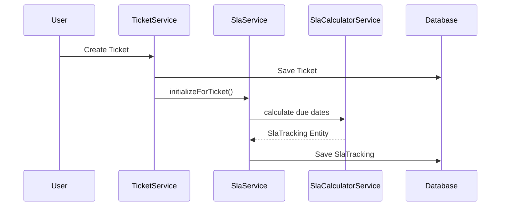

# Enterprise SLA Architecture

This document outlines the Service Level Agreement (SLA) architecture, strategies, and implementation details for the ITSM backend.

## 1. SLA Architecture Overview

The SLA module ensures that tickets are addressed and resolved within defined timeframes according to their priority. The architecture separates the SLA tracking mechanisms from the core ticket workflow to allow tickets to breach SLA without blocking standard workflow transitions. It leverages scheduled background tasks for risk detection and escalation, integrates natively with the Workflow History and Audit Log modules, and provides robust pause/resume capabilities.

## 2. SLA Components

- **`SlaPolicy`**: Defines the target SLA hours based on ticket `Priority`. It configures both `responseTimeHours` and `resolutionTimeHours`. It has an `active` flag to toggle policies.
- **`SlaTracking`**: A 1:1 mapped entity to the `Ticket`. It stores critical timestamps: `startTime`, `dueDate` (for resolution), `firstResponseDueDate`, `breached`, `breachedAt`, `pausedAt`, and `totalPausedDurationMinutes`.
- **`SlaService`**: The core business service managing the CRUD of policies, and handling workflow transition hooks (pausing and resuming).
- **`SlaMonitoringService`**: The engine containing `@Scheduled` background tasks to actively monitor and execute warnings and escalations.
- **`SlaCalculatorService`**: A dedicated utility to handle the date mathematics of calculating due dates upon ticket creation.

## 3. SLA Lifecycle

1. **Initialization:** On ticket creation, an `SlaTracking` record is instantiated using the active `SlaPolicy` matching the ticket's priority.
2. **Monitoring:** Scheduled jobs continuously check the `dueDate` against the current time.
3. **Pausing/Resuming:** Ticket transitions to and from `WAITING_FOR_CUSTOMER` manipulate the `pausedAt` field to suspend the timer.
4. **Escalation/Closure:** If breached, an escalation is triggered. Otherwise, the SLA stops tracking when the ticket is `RESOLVED` or `CLOSED`.

## 4. Due Date Calculation Strategy

Currently, the `SlaCalculatorService` employs a **24/7 continuous calculation strategy**. The SLA due dates are computed by directly adding the configured policy hours (`plusHours()`) to the ticket's `startTime`.

## 5. Resolution SLA vs First Response SLA

The system currently distinguishes between two metrics:
- **First Response Due Date:** The deadline for the first agent interaction.
- **Resolution Due Date (`dueDate`):** The final deadline for moving the ticket to `RESOLVED`.

*Note: The current automated escalation job actively monitors the Resolution `dueDate` for breaches.*

## 6. Pause/Resume Strategy

To prevent agents from being penalized when waiting for external input (e.g., customer clarification), the SLA timer can be paused.

- **Pause Event (`IN_PROGRESS` -> `WAITING_FOR_CUSTOMER`):** The `SlaService` intercepts the transition and records the current timestamp in `pausedAt`.
- **Resume Event (`WAITING_FOR_CUSTOMER` -> `IN_PROGRESS`):** The service calculates the elapsed time between `pausedAt` and `now`. It adds this duration to `totalPausedDurationMinutes` and securely pushes both `dueDate` and `firstResponseDueDate` forward by the exact number of paused minutes. `pausedAt` is then reset to `null`.

## 7. SLA Risk Warning Strategy

To proactively manage SLAs, the system warns agents before a breach occurs:
- The `SlaMonitoringService.checkSlaRisks()` job runs every 5 minutes (`@Scheduled(fixedRate = 300000)`).
- It queries for unbreached tickets where the `dueDate` falls within the next **1 hour**.
- It triggers a `SLA_RISK` notification targeted directly at the assigned agent.

## 8. SLA Escalation Strategy

When an SLA is breached, the system executes an automated escalation.

- **Execution:** `SlaMonitoringService.checkSlaBreaches()` runs every 5 minutes (`@Scheduled(fixedRate = 300000)`).
- **Escalation Action:**
    - `breached` is set to `true` and `breachedAt` is recorded.
    - A workflow history event of `SLA_ESCALATED` is logged under the system user.
    - An audit log is generated.
    - Breach notifications are dispatched to the assignee and all `MANAGER`/`ADMIN` users.

### Why is Escalation NOT a TicketStatus?
Escalation is a parallel tracking mechanism, not a core workflow state. A ticket can be escalated while an agent is actively working on it (`IN_PROGRESS`). Forcing it into an `ESCALATED` status would break the actual lifecycle state machine and complicate transitions (e.g., how to pause an escalated ticket).

### Duplicate Escalation Prevention
The scheduled breach job queries strictly for `findByBreachedFalseAndDueDateBefore(now)`. The very first action taken on a breached record is setting `breached = true`, ensuring that subsequent runs of the background job will bypass it, preventing duplicate notifications and audit spam.

## 9. Auto-close Interaction

Resolved tickets are automatically closed to prevent stale data buildup.
- Handled by the `TicketAutoCloseService` which runs hourly.
- It identifies `RESOLVED` tickets inactive for a specified duration (`itsm.ticket.auto-close-days`, default: 3).

### Why use `RESOLVED` instead of `AUTO_CLOSE_PENDING`?
Introducing a new `AUTO_CLOSE_PENDING` status complicates the workflow matrix and client application logic unnecessarily. `RESOLVED` accurately represents the true business state: the agent has finished the work. Auto-closure is merely a background garbage collection mechanism, operating effectively without requiring an explicit intermediate state.

## 10. Scheduled Job Architecture

The backend utilizes standard Spring `@Scheduled` annotations for asynchronous processing:
- **`SlaMonitoringService`**: Utilizes `fixedRate` (every 5 minutes) for high-frequency time-sensitive checks without overlapping execution issues.
- **`TicketAutoCloseService`**: Utilizes `cron` (`0 0 * * * *` / hourly) for low-frequency cleanup tasks.

## 11. Database Indexing Strategy

For enterprise-scale performance, the tracking queries rely heavily on composite filtering. The database schema must prioritize indexing on:
- `sla_tracking (breached, due_date)` to support the high-frequency 5-minute monitoring sweeps.
- `tickets (status, resolved_at)` to support the hourly auto-close sweeps.

## 12. Audit & Workflow History Integration

SLA breaches and Auto-closures are seamlessly integrated into the historical ledgers. All automated actions are attributed to the internal `system` user. This ensures that the `WorkflowHistory` and `AuditLog` maintain a mathematically perfect, immutable trail of not just user actions, but system-enforced SLA compliance events.

---

## Future Roadmap Considerations

The following items are not currently implemented but represent the strategic evolution of the SLA module.

### 13. Future Working Hours / Business Calendar Strategy
The `SlaCalculatorService` currently executes a flat 24/7 calculation. In the future, this service will be upgraded to utilize a Business Calendar configuration. This will calculate `dueDate` by skipping weekends, company holidays, and non-working hours, providing a true enterprise business-hour SLA.

### 14. Future OpenSearch / Analytics Considerations
As the dataset grows, `breached` flags and `totalPausedDurationMinutes` will be synchronized to an OpenSearch/Elasticsearch cluster to provide real-time SLA compliance dashboards and agent performance analytics.

### 15. Future BPM/jBPM Integration Notes
Currently, SLA tracking relies on Spring `@Scheduled` jobs polling the database. When the jBPM integration is finalized, these SLA timeouts can be modeled as **Boundary Timer Events** directly within the BPMN workflow definition. This delegates the timeout triggers to the jBPM process engine, eliminating database polling and ensuring perfectly synchronized workflow state execution.
