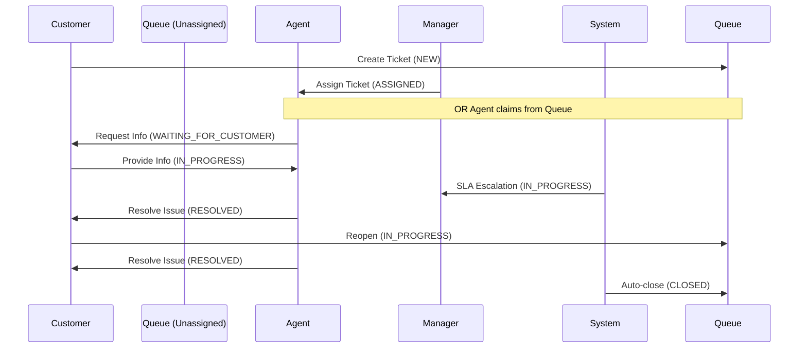

# State Ownership and Responsibility Mapping

This document details the ownership lifecycle, responsibility matrix, and role-based access rules for tickets within the ITSM backend.

## 1. Overview of State Ownership Strategy

State ownership in the ITSM system defines **who is responsible for the ticket at any given time** and **who has the authorization to transition the ticket**.
The system enforces strict role-based access control (RBAC) integrated directly into the workflow transition and assignment policies.

The primary actors are:
- **`CUSTOMER`**: The requester of the ticket.
- **`AGENT`**: The technical resource assigned to resolve the ticket.
- **`MANAGER` / `ADMIN`**: Privileged overseers who manage queues and overrides.
- **`SYSTEM`**: An internal service account responsible for automated background governance (SLA escalations, auto-closures).

## 2. Ticket Ownership Lifecycle

## 3. State Responsibility Matrix

| Ticket Status | Primary Owner / Responsible Party | Authorized to Transition To Next State |
| :--- | :--- | :--- |
| **`NEW`** | Helpdesk Queue (Unassigned) | `AGENT` (Claim), `MANAGER`/`ADMIN` (Assign) |
| **`TRIAGE`** | Helpdesk Queue (Unassigned) | `AGENT` (Claim), `MANAGER`/`ADMIN` (Assign) |
| **`ASSIGNED`** | Assigned `AGENT` | Assigned `AGENT`, `MANAGER`, `ADMIN` |
| **`IN_PROGRESS`** | Assigned `AGENT` | Assigned `AGENT`, `MANAGER`, `ADMIN` |
| **`WAITING_FOR_CUSTOMER`**| Assigned `AGENT` (technical ownership retained) / `CUSTOMER` (action pending) | Assigned `AGENT`, `MANAGER`, `ADMIN` (after customer response) |
| **`RESOLVED`** | `CUSTOMER` (verification pending) / `SYSTEM` governance eligible | `CUSTOMER` (Reopen/Close), Assigned `AGENT` (Reopen), `MANAGER`, `ADMIN`, `SYSTEM` (Auto-close) |
| **`CLOSED`** | None (Terminal) | None |

## 4. Queue Ownership Rules

When a ticket is in `NEW` or `TRIAGE` status, its assignee is `null`. It is considered "owned by the queue".
- No individual agent is penalized for its SLA response time until it is assigned, though the ticket's global SLA timer is ticking.
- Managers are responsible for monitoring the unassigned queue to ensure tickets do not languish.

## 5. Assignment Rules

Ticket assignment is governed by `WorkflowAssignmentPolicy.canAssign()`.
- **Managers and Admins** can assign or reassign any ticket to any user who possesses the `AGENT` role.
- Assignment automatically transitions `NEW` or `TRIAGE` tickets into the `ASSIGNED` state.
- Assignment logs an immutable `STATUS_TRANSITION` under the user who performed the assignment.

## 6. Agent Claim Rules

Agents have restricted assignment capabilities:
- **Claiming:** An `AGENT` can assign a ticket to themselves (**claim** it) *only if* the ticket is currently unassigned (`assignee == null`).
- **Reassignment Restriction:** An `AGENT` **cannot** reassign a ticket that is already owned by another agent. They must request a Manager to reassign it.

## 7. Customer Ownership Rules

The `CUSTOMER` is the original requester of the ticket. Their ownership rights are strictly limited to their own data:
- They can view their own tickets.
- They cannot assign or claim tickets.
- They cannot arbitrarily change the status of a ticket, with the exception of the `RESOLVED` state (see Reopen/Close rules).

## 8. Reopen Ownership Rules

The `RESOLVED` state implies the agent believes the work is finished, pushing ownership back to the customer for verification.
- **`CUSTOMER`**: Can explicitly close or reopen *their own* tickets.
- **Assigned `AGENT`**: Can reopen their own assigned tickets if they realize further work is needed.
- **`MANAGER` / `ADMIN`**: Can globally reopen any resolved ticket.
  Reopening moves the ticket back to `IN_PROGRESS` and logs `TICKET_REOPENED`.

## 9. Escalation Ownership Rules

When an SLA breach occurs, ownership does **not** change, but responsibility is escalated.
- **State Integrity:** SLA Escalation does **not** alter the `TicketStatus`. If an agent is working on a ticket (`IN_PROGRESS`), breaching the SLA keeps the ticket in `IN_PROGRESS`.
- **Why?** Overriding the status to "ESCALATED" would destroy the actual workflow state machine (e.g., losing the ability to pause the SLA, or track resolution).
- **Responsibility Shift:** Instead, `breached=true` is set, and notifications are broadcast to the assignee and all `MANAGER`/`ADMIN` users. A Manager is now organizationally responsible for intervening, even though the Agent remains the technical assignee.

## 10. Auto-close Ownership Rules

Tickets left in `RESOLVED` indefinitely are swept by the `TicketAutoCloseService`.
- The transition from `RESOLVED` to `CLOSED` is executed by the `SYSTEM` user.
- This creates an `AUTO_CLOSED` workflow history record.

### Auto-close Governance Objectives
The auto-close mechanism is essential for maintaining enterprise operational hygiene. It exists to:
- **Prevent Stale Tickets:** Ensure that `RESOLVED` tickets do not remain open indefinitely waiting for a non-responsive customer.
- **Maintain Operational Hygiene:** Continuously flush resolved items to a terminal `CLOSED` state to reduce active processing loads.
- **Accurate SLA & Reporting Metrics:** Prevent abandoned tickets from skewing open-ticket dashboards or historical throughput analytics.
- **Dashboard Purity:** Keep agent and manager dashboards focused purely on actionable items.

## 11. Workflow Governance Principles

### Why does the `SYSTEM` user exist?
Background jobs (like SLA Escalation and Auto-Close) execute outside of an HTTP request context and thus lack a traditional Spring Security `Authentication` token.
The internal `SYSTEM` user exists in the database to act as the authoritative executor of these automated actions. This ensures that every entry in the `WorkflowHistory` and `AuditLog` has a mathematically perfect, non-null foreign key to an acting user, maintaining strict audit compliance.

## 12. Security & Authorization Notes

- **Endpoint Security:** The `TicketController` endpoints for `/assign`, `/claim`, `/status`, and `/reopen` utilize method-level programmatic security checks within `TicketService`.
- **Privilege Separation:** Read access (`getTicketByIdAndCheckAccess`) rigorously ensures `CUSTOMER`s can only fetch their own ID, while privileged roles can read globally.

### Resource-Level Security and Ownership Validation
The backend enforces security by evaluating **BOTH** role-based and resource-level authorization simultaneously:
- **Requester Ownership:** Possessing the `CUSTOMER` role is insufficient to access or modify a ticket. The backend actively performs ownership validation to ensure the requesting user's identity precisely matches the ticket's original requester.
- **Assignment-Bound Permissions:** While `AGENT`s have elevated privileges compared to customers, their modification rights (e.g., updating statuses or reopening) are tightly constrained by assignment ownership. An agent cannot modify a ticket assigned to a peer.
- **Administrative Overrides:** `MANAGER` and `ADMIN` roles possess global resource-level overrides, allowing them to bypass individual assignment restrictions for holistic queue management.

---

## Future Roadmap Considerations

### 13. Future Multi-Team / Queue Routing Considerations
Currently, the system uses a flat global queue (`assignee == null`). Future iterations will introduce a `SupportGroup` or `Team` entity. Tickets will route to a `Team` queue rather than sitting globally, and Agents will only be permitted to claim tickets assigned to their respective teams.

### 14. Future BPM/jBPM Ownership Integration Notes
When jBPM is fully integrated, human task assignment will be governed by BPMN **User Tasks**.
- The jBPM engine will natively handle Potential Owners (the queue) and Actual Owners (the claimed agent).
- The `WorkflowAssignmentPolicy` will act as a synchronizing bridge between the Spring Security context and the jBPM human task service.
