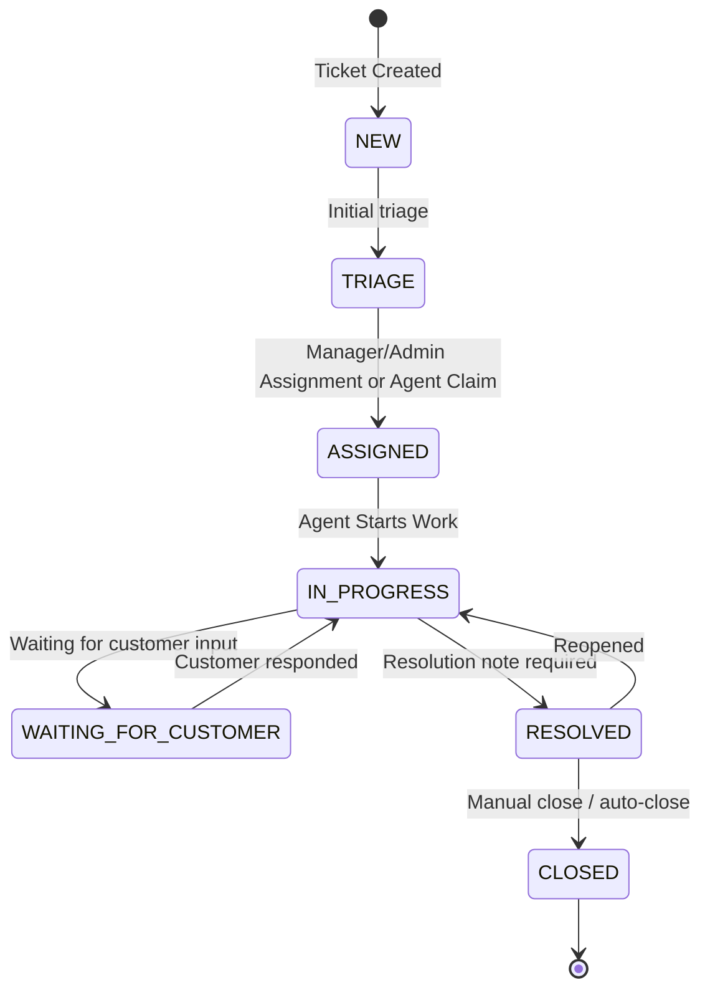

# Ticket Workflow Lifecycle

This document describes the ticket lifecycle, status transitions, SLA behaviors, and workflow automation implemented in the ITSM backend.

## 1. Overview of the Ticket Lifecycle

The ticket lifecycle in the ITSM system is designed to track a ticket from its initial creation by a user to its final closure. It enforces specific states to ensure that tickets are properly triaged, assigned, worked on, and resolved. Automated systems run in the background to handle SLA tracking, escalations, and auto-closing inactive resolved tickets.

## 2. Current Workflow Diagram

## 3. Transition Matrix

Status transitions are strictly enforced by the `WorkflowTransitionPolicy`. The following table details the allowed transitions:

| Current Status | Allowed Next Statuses | Description |
| :--- | :--- | :--- |
| **NEW** | `TRIAGE` | Initial state. Needs to be triaged. |
| **TRIAGE** | `ASSIGNED` | Ticket is triaged and assigned to an agent. |
| **ASSIGNED** | `IN_PROGRESS` | Agent begins working on the ticket. |
| **IN_PROGRESS** | `WAITING_FOR_CUSTOMER`, `RESOLVED` | Agent is actively working. Can pause for customer input or resolve the ticket. |
| **WAITING_FOR_CUSTOMER**| `IN_PROGRESS` | Customer responded; work resumes. |
| **RESOLVED** | `CLOSED`, `IN_PROGRESS` | Issue is fixed. Can be closed or reopened (`IN_PROGRESS`). |
| **CLOSED** | None | Terminal state. |

## 4. Invalid Transition Rules

Any status transition not explicitly defined in the `WorkflowTransitionPolicy` will be rejected by the `TicketService`.
Attempting an invalid transition throws a `RuntimeException` with the message `"Invalid status transition: {currentStatus} -> {newStatus}"`. Only permitted roles (Agents, Managers, Admins) can perform status updates. Furthermore, **CLOSED** tickets are considered terminal and cannot be reopened or transitioned to any other state through normal workflow operations.

## 5. Assignment and Claim Behavior

- **Claiming & Assigning Roles:**
    - **Managers and Admins** can manually assign or reassign tickets to any agent.
    - **Agents** can only claim tickets that are currently unassigned. Agents cannot reassign tickets owned by another agent.
- **Workflow Action:** Assigning a ticket triggers `WorkflowEngineServiceImpl.executeAssignment()`.
- **Status Update:** If the ticket is currently in the `NEW` or `TRIAGE` state, an assignment or claim automatically advances its status to `ASSIGNED`.
- **History Tracking:** The assignment is logged in `WorkflowHistory` with a `STATUS_TRANSITION` action and corresponding audit logs.

## 6. SLA Pause/Resume Behavior

SLA monitoring handles the time a ticket spends waiting for the customer, ensuring the agent's SLA is not penalized.
- **Pause (`IN_PROGRESS` -> `WAITING_FOR_CUSTOMER`):** The `SlaService` captures the current time in the `pausedAt` field.
- **Resume (`WAITING_FOR_CUSTOMER` -> `IN_PROGRESS`):** The system calculates the elapsed time, adds it to `totalPausedDurationMinutes`, and extends both `dueDate` and `firstResponseDueDate` by the paused duration. The `pausedAt` field is then cleared.

## 7. Resolution Note Requirement

When a ticket is transitioned to `RESOLVED`, a resolution note (comment) is strictly required.
- Validation occurs natively in the workflow execution path (`WorkflowEngineServiceImpl.executeTransition()`).
- If the comment is missing or blank, a `BadRequestException` is thrown: `"Resolution note is required when resolving a ticket"`.
- The resolution comment is permanently recorded in the `WorkflowHistory`.

## 8. Reopen Behavior

- Tickets can only be reopened from the `RESOLVED` state.
- Reopening a ticket transitions it back to `IN_PROGRESS`.
- **Lifecycle Reset:** Reopening a ticket clears its `resolvedAt` timestamp (`null`).
- **History Tracking:** The transition is explicitly recorded in `WorkflowHistory` with the action `TICKET_REOPENED`.
- **Permissions:** Customers can reopen their own tickets; privileged users (Agents, Managers, Admins) can reopen tickets according to standard access rules.

## 9. Auto-close Behavior

The system automatically closes resolved tickets to prevent them from remaining open indefinitely.
- **Mechanism:** Managed by `TicketAutoCloseService` which runs every hour (`@Scheduled(cron = "0 0 * * * *")`).
- **Condition:** Auto-close only applies to inactive tickets in the `RESOLVED` state where the `resolvedAt` timestamp is older than the configured `itsm.ticket.auto-close-days` (default: 3 days). Reopening a ticket resets this resolution lifecycle.
- **Execution:** Transitions the ticket to `CLOSED` using the `system` user. Logs the explicit action `AUTO_CLOSED` in both the `WorkflowHistory` and `AuditLog`.

## 10. SLA Escalation Behavior

The `SlaMonitoringService` actively tracks ticket SLAs using a scheduled job (`@Scheduled(fixedRate = 300000)`).
- **Warnings (SLA Risk):** If a ticket is unbreached and its due date is within 1 hour, a warning notification is sent to the assigned agent.
- **Breaches (SLA Escalation):** If the due date passes, the SLA is escalated. `breached=true` and `breachedAt` are set on the `SlaTracking` record to prevent duplicate escalations (the background job queries for `breached=false`). The system user records an `SLA_ESCALATED` event in the workflow history. Notifications are sent simultaneously to the assignee and all users with `MANAGER` or `ADMIN` roles.

## 11. Workflow History Strategy

The `WorkflowHistory` entity maintains a full audit trail of the ticket's lifecycle.
- Records `fromStatus`, `toStatus`, `action`, `comment`, and the `performedBy` user.
- Common tracking actions include:
    - `STATUS_TRANSITION`: Standard state movements or assignment triggered advancements.
    - `TICKET_REOPENED`: Manual move from RESOLVED back to IN_PROGRESS.
    - `SLA_ESCALATED`: System triggered breach.
    - `AUTO_CLOSED`: System triggered closure due to inactivity.
- Provides an immutable ledger of how long a ticket stayed in each state, who moved it, and why.

## 12. BPMN/jBPM Future Integration Notes

The system is designed with a facade for seamless future jBPM integration.
- The `WorkflowEngineServiceImpl` acts as the primary abstraction layer. It currently encapsulates hardcoded transitional requirements but provides the exact footprint for BPM orchestration.
- Upon ticket creation, `WorkflowService.startTicketProcess()` is called, and the resulting `processInstanceId` is saved directly to the ticket as part of the integration strategy.
- Once jBPM is fully implemented, the `WorkflowEngineServiceImpl` will delegate state validations and transitions to the running jBPM process engine instance, allowing for dynamic BPMN-based workflows without refactoring the core `TicketService` or breaking existing logic.
